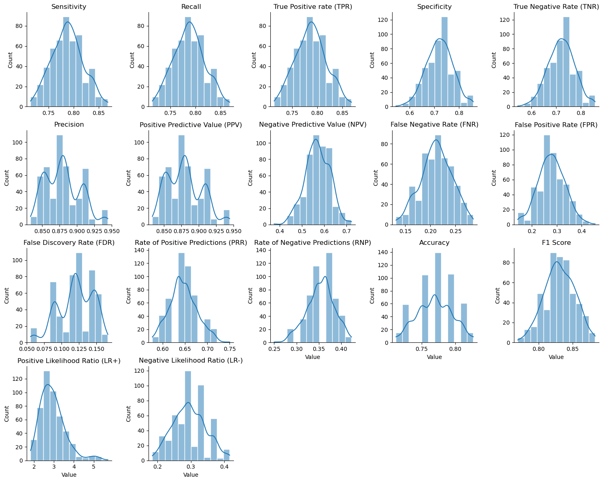

# README

## Introduction

The `mcm` function is a tool for analyzed different metrics from a confusion matrix. 

This function depends of `pandas` and the function `confusion_matrix` from `sklearn.metrics`.


```python
import pandas as pd
from sklearn.metrics import confusion_matrix
```


```python
?confusion_matrix
```


    Compute confusion matrix to evaluate the accuracy of a classification.
    
    By definition a confusion matrix :math:`C` is such that :math:`C_{i, j}`
    is equal to the number of observations known to be in group :math:`i` and
    predicted to be in group :math:`j`.
    
    Thus in binary classification, the count of true negatives is
    :math:`C_{0,0}`, false negatives is :math:`C_{1,0}`, true positives is
    :math:`C_{1,1}` and false positives is :math:`C_{0,1}`.
    
    Read more in the :ref:`User Guide <confusion_matrix>`.
    
    Parameters
    ----------
    y_true : array-like of shape (n_samples,)
        Ground truth (correct) target values.
    
    y_pred : array-like of shape (n_samples,)
        Estimated targets as returned by a classifier.
    
    labels : array-like of shape (n_classes), default=None
        List of labels to index the matrix. This may be used to reorder
        or select a subset of labels.
        If ``None`` is given, those that appear at least once
        in ``y_true`` or ``y_pred`` are used in sorted order.
    
    sample_weight : array-like of shape (n_samples,), default=None
        Sample weights.
    
    normalize : {'true', 'pred', 'all'}, default=None
        Normalizes confusion matrix over the true (rows), predicted (columns)
        conditions or all the population. If None, confusion matrix will not be
        normalized.
    
    Returns
    -------
    C : ndarray of shape (n_classes, n_classes)
        Confusion matrix.
    
    References
    ----------
    .. [1] `Wikipedia entry for the Confusion matrix
           <https://en.wikipedia.org/wiki/Confusion_matrix>`_
           (Wikipedia and other references may use a different
           convention for axes)
    
    Examples
    --------
    >>> from sklearn.metrics import confusion_matrix
    >>> y_true = [2, 0, 2, 2, 0, 1]
    >>> y_pred = [0, 0, 2, 2, 0, 2]
    >>> confusion_matrix(y_true, y_pred)
    array([[2, 0, 0],
           [0, 0, 1],
           [1, 0, 2]])
    
    >>> y_true = ["cat", "ant", "cat", "cat", "ant", "bird"]
    >>> y_pred = ["ant", "ant", "cat", "cat", "ant", "cat"]
    >>> confusion_matrix(y_true, y_pred, labels=["ant", "bird", "cat"])
    array([[2, 0, 0],
           [0, 0, 1],
           [1, 0, 2]])
    
    In the binary case, we can extract true positives, etc as follows:
    
    >>> tn, fp, fn, tp = confusion_matrix([0, 1, 0, 1], [1, 1, 1, 0]).ravel()
    >>> (tn, fp, fn, tp)
    (0, 2, 1, 1)


```python
data = pd.DataFrame({
    'y_true': ['Positive']*47 + ['Negative']*18,
    'y_pred': ['Positive']*37 + ['Negative']*10 + ['Positive']*5 + ['Negative']*13})
```


```python
confusion_matrix(y_true = data.y_true, 
                 y_pred = data.y_pred, 
                 labels = ['Negative', 'Positive'])
```


    array([[13,  5],
           [10, 37]], dtype=int64)


In this case, from the confusion matrix we have the following results:

  * True Positive (TP): 34
  * True Negative (TN): 13
  * False Positive (FP): 5
  * False Negative (FN): 10
    


```python
tn, fp, fn, tp = confusion_matrix(y_true = data.y_true, 
                                  y_pred = data.y_pred, 
                                  labels = ['Negative', 'Positive']).ravel()
```


```python
(tn, fp, fn, tp)
```

    (13, 5, 10, 37)
    
## Metrics

Metrics are statistical measures of the performance of a binary classification model.

### Sensitivity, Recall and True Positive Rate (TPR)

Sensitivity refers to the test's ability to correctly detect negative class who do have the condition.

$$\dfrac{TP}{TP + FN}$$


    
### Specificity and True Negative Rate (TNR)

Specificity relates to the test's ability to correctly reject positive class without a condition. 

$$\dfrac{TN}{TN + FP}$$


### Precision and Positive Predictive Value (PPV)

$$\dfrac{TP}{TP + FP}$$

### Negative Predictive Value (NPV)

$$\dfrac{TN}{TN + FN}$$

### False Negative Rate (FNR)

$$\dfrac{FN}{FN + TP}$$

### False Positive Rate (FPR)

$$\dfrac{FP}{FP + TN}$$

### False Discovery Rate (FDR)

$$\dfrac{FP}/{FP + TP}$$

### Accuracy

$$\dfrac{TP + TN}{TP + TN + FP + FN}$$

### F1 Score

$$\dfrac{2\cdot TP}{2\cdot TP + FP + FN}$$


## MCM function

The `mcm`has been developed as:


```python
def mcm(tn, fp, fn, tp):
    """Let be a confusion matrix like this:
    
    
      N    P
    +----+----+
    |    |    |
    | TN | FP |
    |    |    |
    +----+----+
    |    |    |
    | FN | TP |
    |    |    |
    +----+----+
    
    The observed values by columns and the expected values by rows and the positive class in right column. With these definitions, the TN, FP, FN and TP values are that order.
    
    
    Parameters
    ----------
    TN : integer
        True Negative
    FP: integer
        False Positive
    FN: integer
        False Negative
    TP: integer
        True Positive
   
    Returns
    -------
    sum : float
        Sum of values
    
    Notes
    -----
    https://en.wikipedia.org/wiki/Confusion_matrix
    https://developer.lsst.io/python/numpydoc.html
    
    Examples
    --------
    data = pd.DataFrame({
    'y_true': ['Positive']*47 + ['Negative']*18,
    'y_pred': ['Positive']*37 + ['Negative']*10 + ['Positive']*5 + ['Negative']*13})
    
    tn, fp, fn, tp = confusion_matrix(y_true = data.y_true, 
                                  y_pred = data.y_pred, 
                                  labels = ['Negative', 'Positive']).ravel()
    
    """
    mcm = []
    
    mcm.append(['Sensitivity', tp / (tp + fn)])
    mcm.append(['Recall', tp / (tp + fn)])
    mcm.append(['True Positive rate (TPR)', tp / (tp + fn)])
    mcm.append(['Specificity', tn / (tn + fp)])
    mcm.append(['True Negative Rate (TNR)', tn / (tn + fp)])
    
    mcm.append(['Precision', tp / (tp + fp)])
    mcm.append(['Positive Predictive Value (PPV)', tp / (tp + fp)])
    mcm.append(['Negative Predictive Value (NPV)', tn / (tn + fn)])
        
    mcm.append(['False Negative Rate (FNR)', fn / (fn + tp)])
    mcm.append(['False Positive Rate (FPR)', fp / (fp + tn)])
    mcm.append(['False Discovery Rate (FDR)', fp / (fp + tp)])
    
    mcm.append(['Accuracy', (tp + tn) / (tp + tn + fp + fn)])
    mcm.append(['F1 Score', 2*tp / (2*tp + fp + fn)])
    
    tpr = tp / (tp + fn)
    fpr = fp / (fp + tn)
    
    fnr = fn / (fn + tp)
    tnr = tn / (tn + fp)
    
    mcm.append(['Positive Likelihood Ratio (LR+)', tpr / fpr])
    mcm.append(['Negative Likelihood Ratio (LR-)', fnr / tnr])
    
    return pd.DataFrame(mcm, columns = ['Metric', 'Value'])


```


```python
?mcm
```

    Let be a confusion matrix like this:
    
    
      N    P
    +----+----+
    |    |    |
    | TN | FP |
    |    |    |
    +----+----+
    |    |    |
    | FN | TP |
    |    |    |
    +----+----+
    
    The observed values by columns and the expected values by rows and the positive class in right column. With these definitions, the TN, FP, FN and TP values are that order.
    
    
    Parameters
    ----------
    TN : integer
        True Negative
    FP: integer
        False Positive
    FN: integer
        False Negative
    TP: integer
        True Positive
    
    Returns
    -------
    sum : float
        Sum of values
    
    Notes
    -----
    https://en.wikipedia.org/wiki/Confusion_matrix
    https://developer.lsst.io/python/numpydoc.html
    
    Examples
    --------
    data = pd.DataFrame({
    'y_true': ['Positive']*47 + ['Negative']*18,
    'y_pred': ['Positive']*37 + ['Negative']*10 + ['Positive']*5 + ['Negative']*13})
    
    tn, fp, fn, tp = confusion_matrix(y_true = data.y_true, 
                                  y_pred = data.y_pred, 
                                  labels = ['Negative', 'Positive']).ravel()

The arguments of `mcm` function are: true positive (tn), false positive (fp), false negative (fn) and true positive (tp) is this order.

```python
mcm(tn, fp, fn, tp)
```

<div>
<style scoped>
    .dataframe tbody tr th:only-of-type {
        vertical-align: middle;
    }

    .dataframe tbody tr th {
        vertical-align: top;
    }

    .dataframe thead th {
        text-align: right;
    }
</style>
<table border="1" class="dataframe">
  <thead>
    <tr style="text-align: right;">
      <th></th>
      <th>Metric</th>
      <th>Value</th>
    </tr>
  </thead>
  <tbody>
    <tr>
      <th>0</th>
      <td>Sensitivity</td>
      <td>0.787234</td>
    </tr>
    <tr>
      <th>1</th>
      <td>Recall</td>
      <td>0.787234</td>
    </tr>
    <tr>
      <th>2</th>
      <td>True Positive rate (TPR)</td>
      <td>0.787234</td>
    </tr>
    <tr>
      <th>3</th>
      <td>Specificity</td>
      <td>0.722222</td>
    </tr>
    <tr>
      <th>4</th>
      <td>True Negative Rate (TNR)</td>
      <td>0.722222</td>
    </tr>
    <tr>
      <th>5</th>
      <td>Precision</td>
      <td>0.880952</td>
    </tr>
    <tr>
      <th>6</th>
      <td>Positive Predictive Value (PPV)</td>
      <td>0.880952</td>
    </tr>
    <tr>
      <th>7</th>
      <td>Negative Predictive Value (NPV)</td>
      <td>0.565217</td>
    </tr>
    <tr>
      <th>8</th>
      <td>False Negative Rate (FNR)</td>
      <td>0.212766</td>
    </tr>
    <tr>
      <th>9</th>
      <td>False Positive Rate (FPR)</td>
      <td>0.277778</td>
    </tr>
    <tr>
      <th>10</th>
      <td>False Discovery Rate (FDR)</td>
      <td>0.119048</td>
    </tr>
    <tr>
      <th>11</th>
      <td>Accuracy</td>
      <td>0.769231</td>
    </tr>
    <tr>
      <th>12</th>
      <td>F1 Score</td>
      <td>0.831461</td>
    </tr>
    <tr>
      <th>13</th>
      <td>Positive Likelihood Ratio (LR+)</td>
      <td>2.834043</td>
    </tr>
    <tr>
      <th>14</th>
      <td>Negative Likelihood Ratio (LR-)</td>
      <td>0.294599</td>
    </tr>
  </tbody>
</table>
</div>


### Bootstrap

We can call the function `mcm` several times with a percentage of samples and estimate the distribution of each metrics.

In the following example, a 80% of the samples has been used in each iteration.


```python
data = pd.DataFrame({
    'y_true': ['Positive']*47 + ['Negative']*18,
    'y_pred': ['Positive']*37 + ['Negative']*10 + ['Positive']*5 + ['Negative']*13})
```


```python
mcm_bootstrap = []

for i in range(100):
    aux = data.sample(frac = 0.8) # 80% of the samples
    tn, fp, fn, tp =\
        confusion_matrix(y_true = aux.y_true, 
                         y_pred = aux.y_pred, 
                         labels = ['Negative', 'Positive']).ravel()

    mcm_bootstrap.append(mcm(tn, fp, fn, tp))
```

After 100 iterations we can be evaluate the mean, median, minimum, maximum and standar deviation for each metric.


```python
pd\
    .concat(mcm_bootstrap)\
    .groupby('Metric')\
    .agg({'Value' : ['mean', 'median', 'min', 'max', 'std']})
```


<div>
<style scoped>
    .dataframe tbody tr th:only-of-type {
        vertical-align: middle;
    }

    .dataframe tbody tr th {
        vertical-align: top;
    }

    .dataframe thead tr th {
        text-align: left;
    }

    .dataframe thead tr:last-of-type th {
        text-align: right;
    }
</style>
<table border="1" class="dataframe">
  <thead>
    <tr>
      <th></th>
      <th colspan="5" halign="left">Value</th>
    </tr>
    <tr>
      <th></th>
      <th>mean</th>
      <th>median</th>
      <th>min</th>
      <th>max</th>
      <th>std</th>
    </tr>
    <tr>
      <th>Metric</th>
      <th></th>
      <th></th>
      <th></th>
      <th></th>
      <th></th>
    </tr>
  </thead>
  <tbody>
    <tr>
      <th>Accuracy</th>
      <td>0.767500</td>
      <td>0.769231</td>
      <td>0.711538</td>
      <td>0.826923</td>
      <td>0.025800</td>
    </tr>
    <tr>
      <th>F1 Score</th>
      <td>0.830278</td>
      <td>0.828571</td>
      <td>0.794118</td>
      <td>0.880000</td>
      <td>0.020213</td>
    </tr>
    <tr>
      <th>False Discovery Rate (FDR)</th>
      <td>0.119385</td>
      <td>0.121212</td>
      <td>0.057143</td>
      <td>0.156250</td>
      <td>0.024744</td>
    </tr>
    <tr>
      <th>False Negative Rate (FNR)</th>
      <td>0.213905</td>
      <td>0.216216</td>
      <td>0.138889</td>
      <td>0.263158</td>
      <td>0.028851</td>
    </tr>
    <tr>
      <th>False Positive Rate (FPR)</th>
      <td>0.281694</td>
      <td>0.285714</td>
      <td>0.142857</td>
      <td>0.454545</td>
      <td>0.058819</td>
    </tr>
    <tr>
      <th>Negative Likelihood Ratio (LR-)</th>
      <td>0.299955</td>
      <td>0.296296</td>
      <td>0.202020</td>
      <td>0.447154</td>
      <td>0.049006</td>
    </tr>
    <tr>
      <th>Negative Predictive Value (NPV)</th>
      <td>0.559698</td>
      <td>0.555556</td>
      <td>0.375000</td>
      <td>0.705882</td>
      <td>0.058436</td>
    </tr>
    <tr>
      <th>Positive Likelihood Ratio (LR+)</th>
      <td>2.927705</td>
      <td>2.800498</td>
      <td>1.663415</td>
      <td>5.526316</td>
      <td>0.707941</td>
    </tr>
    <tr>
      <th>Positive Predictive Value (PPV)</th>
      <td>0.880615</td>
      <td>0.878788</td>
      <td>0.843750</td>
      <td>0.942857</td>
      <td>0.024744</td>
    </tr>
    <tr>
      <th>Precision</th>
      <td>0.880615</td>
      <td>0.878788</td>
      <td>0.843750</td>
      <td>0.942857</td>
      <td>0.024744</td>
    </tr>
    <tr>
      <th>Recall</th>
      <td>0.786095</td>
      <td>0.783784</td>
      <td>0.736842</td>
      <td>0.861111</td>
      <td>0.028851</td>
    </tr>
    <tr>
      <th>Sensitivity</th>
      <td>0.786095</td>
      <td>0.783784</td>
      <td>0.736842</td>
      <td>0.861111</td>
      <td>0.028851</td>
    </tr>
    <tr>
      <th>Specificity</th>
      <td>0.718306</td>
      <td>0.714286</td>
      <td>0.545455</td>
      <td>0.857143</td>
      <td>0.058819</td>
    </tr>
    <tr>
      <th>True Negative Rate (TNR)</th>
      <td>0.718306</td>
      <td>0.714286</td>
      <td>0.545455</td>
      <td>0.857143</td>
      <td>0.058819</td>
    </tr>
    <tr>
      <th>True Positive rate (TPR)</th>
      <td>0.786095</td>
      <td>0.783784</td>
      <td>0.736842</td>
      <td>0.861111</td>
      <td>0.028851</td>
    </tr>
  </tbody>
</table>
</div>


## Display

Loading the matplotlib and seaborn to display the results.


```python
import matplotlib.pyplot as plt
import seaborn as sns
```

For example, if we want to display the distribution of accuracy we can execute the follwoing code.


```python
aux = pd.concat(mcm_bootstrap)
aux\
    .query('Metric == "Accuracy"')\
    .plot(kind = 'density', label = 'Accuracy')
plt.show()
```


    

    


With seaborn is easy to display the distribution of all metrics.


```python
g = sns.FacetGrid(pd.concat(mcm_bootstrap), 
                  col = 'Metric', 
                  col_wrap = 5, 
                  sharey = False, 
                  sharex = False)
g = g.map(sns.distplot, 'Value', 
          hist = True, 
          kde = True, 
          rug = True, 
          hist_kws = {'color': 'C0'}, 
          kde_kws = {'color': 'red', 'linewidth': 2}, 
          rug_kws = {'color': 'black'})
g = g.set_titles('{col_name}', size = 12)
```


    

    


The `mcm` function can help us to analyse a confusion matrix. If this confusion matrix come from a performed model, we can evaluate it with this function: Sensitivity and Specificity as principal metrics.
